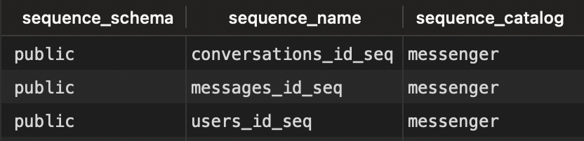
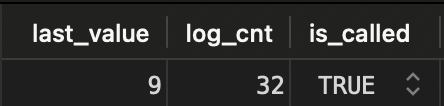
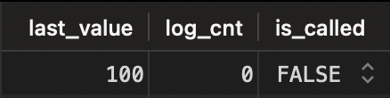

## How to RESET a SEQUENCE in PostgreSQL?

### Step 1. List Sequences

```
SELECT
	sequence_schema,
	sequence_name,
	sequence_catalog
FROM
	information_schema.sequences s
ORDER BY
	sequence_name;
```

## 


### Step 2: Fetch Sequence Data

```
SELECT * FROM users_id_seq;
```



The above snippet indicates that the sequence of table users current value is **_9_**.


### Step 3: Reset Sequence

```
ALTER SEQUENCE users_id_seq
	RESTART WITH 100;
```

result:

> Query 1 OK: ALTER SEQUENCE


### Step 4: Verify Sequence Modification

```
SELECT * FROM users_id_seq;
```



The sequence value has been successfully reset to 100.
